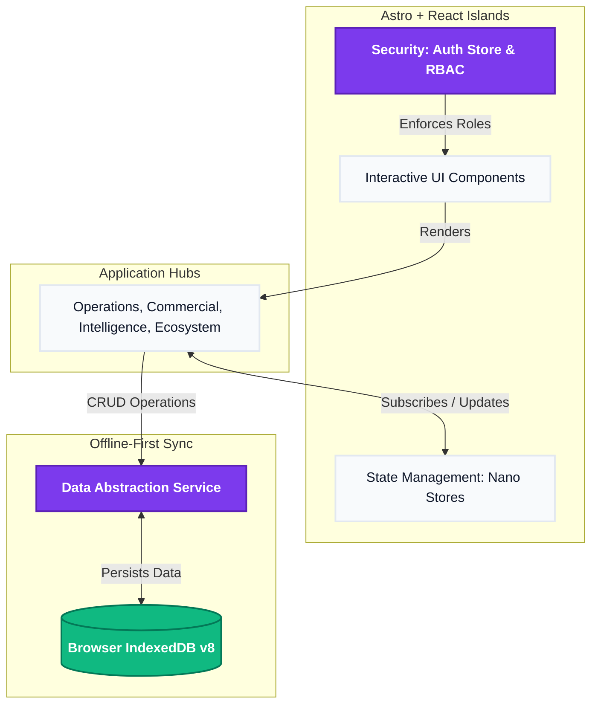

# BPA PRO: Enterprise Operating System 🚀

BPA PRO is a next-generation, highly-performant, **Offline-First Enterprise Operating System** built using the **Astro.js Islands Architecture** and React. It serves as a unified workspace connecting CRM, Project Management, Human Resources, Document Management, AI Agents, and App Integrations seamlessly in one location.

Designed for modern agencies, it acts as the central nervous system bridging the gap between internal operations and external client communications.

---

## ✨ Key Features

- **Offline-First Synchronization (IndexedDB v8):** Powered by a customized `DataService`, all modules (Tasks, Neural Documents, CRM Leads, Candidates, App Integrations, Support Tickets) instantly save and persist data directly inside the browser—no backend required.
- **Role-Based Access Control (RBAC):** Dynamic sidebar navigation strictly enforces security policies. For example, an HR Admin sees the Operations Hub, clients only see the external Portal, while the CEO receives full visibility and executive intelligence.
- **Islands Architecture:** Utilizes Astro.js to render zero-JavaScript static HTML by default, selectively hydrating interactive React components only when necessary.
- **Glassmorphic UI/UX:** Stunning, modern interface built with Tailwind CSS and Framer Motion, delivering micro-animations, dynamic shadowing, and localized currency formatting.

---

## 🏗 The 5 Pillars (Phases) of BPA PRO

BPA PRO was engineered across 5 massive phases of development:

### 1. Foundation & Security
- **Identity & RBAC:** Secure login gate defining user roles (CEO, HR Admin, Lead Engineer, Sales Director, Client).
- **Audit & Compliance:** Centralized logging of all system actions for compliance.

### 2. Operations Hub
- **Workflow Orchestration:** A visual, node-based builder to automate business processes (Triggers → Conditions → Actions).
- **Resource Planner:** Calendar UI to manage employee shifts, PTO, and project allocation.
- **Approval Inbox:** Centralized hub for reviewing timesheets, leave requests, and expenses.

### 3. Commercial Hub
- **Financial CRM:** Track leads, conversion pipelines, and candidate recruitment.
- **Proposals & Contracts:** Dynamic proposal generation and contract lifecycle management.
- **Asset Management:** Track hardware and software assigned to employees.

### 4. Intelligence Hub
- **Executive Command Center:** Real-time CEO dashboard tracking ARR, Utilization, and Project Risk via predictive algorithms.
- **AI Agent Fleets:** Monitor and orchestrate autonomous background workers (e.g., Lead Scorer Alpha, Invoice Chaser).
- **Neural Documents:** An AI-powered Knowledge Hub with semantic search mockup for company wikis and SOPs.
- **Process Analytics:** Interactive `recharts` data visualizations for Sales Conversion Rates and Departmental Profitability.

### 5. Ecosystem 
- **Client Portal:** A pristine, white-labeled external interface for clients to view active projects, pay invoices, and submit support tickets.
- **Integration Hub:** An "App Store" marketplace for connecting Slack, Jira, QuickBooks, Stripe, GitHub, and HubSpot.
- **System Settings:** Global configurations for agency white-labeling (logo uploads, primary/accent brand colors, custom domains).

---

## 🛠 Tech Stack

- **Framework:** Astro.js
- **UI Components:** React
- **Styling:** Tailwind CSS
- **Animations:** Framer Motion
- **Charting:** Recharts
- **Icons:** Lucide React
- **State Management:** Nano Stores
- **Database / Persistence:** IndexedDB

---

## 🏗 System Architecture & Working

The platform relies on a decentralized, frontend-first architecture. User interactions update the Nano Store for immediate UI repaints, while the `DataService` simultaneously commits the payloads to the local IndexedDB.



---

## 🚀 Getting Started

### Prerequisites
- Node.js >= 20.0.0

### Installation
1. Clone the repository.
2. Install the dependencies:
   ```bash
   npm install
   ```

### Development
Run the local development server:
```bash
npm run dev
```
Navigate to `http://localhost:4321` to view the application.

### Building for Production
To build the static application:
```bash
npm run build
```
Preview the production build locally:
```bash
npm run preview
```

---

## 🔐 Authentication & Roles

On load, the application provides an **Identity Selection** screen. You can log in as different mock users to test the RBAC capabilities:
- **Harish (CEO):** Full System Access
- **Sathya (HR Admin):** Operations Hub, Tasks
- **Praneeth (Lead Engineer):** Workspace, Integrations
- **Priya (Sales Director):** CRM, Commercial, Analytics
- **Acme Corp (Client):** Client Portal Only
