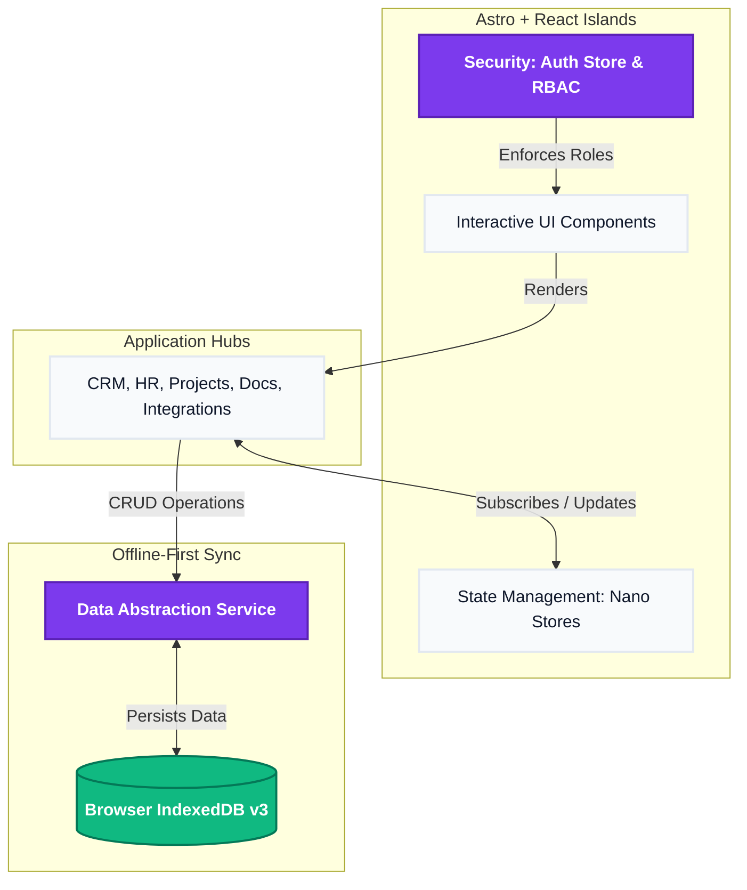

# BPA PRO: Enterprise Operating System 🚀

BPA PRO is a next-generation, highly-performant, Offline-First Enterprise Operating System built using the **Astro.js Islands Architecture**. It serves as a unified workspace connecting CRM, Project Management, Human Resources, Document Management, and API Integrations seamlessly in one location.

## ✨ Key Features
- **Offline-First Synchronization:** Powered by a customized IndexedDB `DataService`, all modules (Tasks, Documents, CRM Leads, Candidates, Integrations) instantly save and persist data directly inside the browser—no backend required.
- **Role-Based Access Control (RBAC):** Dynamic sidebar navigation strictly enforces security policies. An HR Admin only sees the Operations Hub, while the CEO receives full visibility across the platform.
- **Islands Architecture:** Utilizes Astro.js to render zero-JavaScript static HTML by default, selectively hydrating interactive React components only when necessary.
- **Glassmorphic UI/UX:** Stunning, modern interface built with Tailwind CSS and Framer Motion, delivering micro-animations, dynamic shadowing, and localized currency (₹).

## 🛠 Tech Stack
- **Framework:** Astro.js
- **UI Components:** React
- **Styling:** Tailwind CSS
- **Animations:** Framer Motion
- **State Management:** Nano Stores
- **Database / Persistence:** IndexedDB
- **Icons:** Lucide React

## 🏗 System Architecture & Working

The platform relies on a decentralized, frontend-first architecture. User interactions update the Nano Store for immediate UI repaints, while the `DataService` simultaneously commits the payloads to the local IndexedDB.



## 🚀 Getting Started

### Prerequisites
- Node.js >= 20.0.0

### Installation
1. Clone the repository.
2. Install the dependencies:
   ```bash
   npm install
   ```

### Development
Run the local development server:
```bash
npm run dev
```
Navigate to `http://localhost:4321` to view the application.

### Building for Production
To build the static application:
```bash
npm run build
```
Preview the production build locally:
```bash
npm run preview
```

## 🔐 Authentication & Roles
On load, the application provides an **Identity Selection** screen. You can log in as different mock users to test the RBAC capabilities:
- **Harish (CEO):** Full Access
- **Sathya (HR Admin):** Operations Hub, Tasks
- **Praneeth (Lead Engineer):** Workspace, Integrations
- **Priya (Sales Director):** CRM, Analytics
